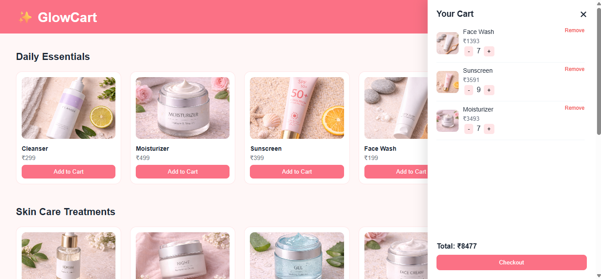
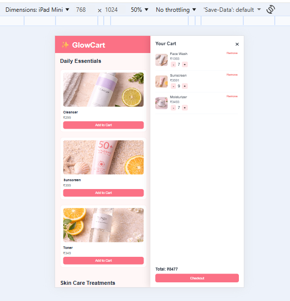
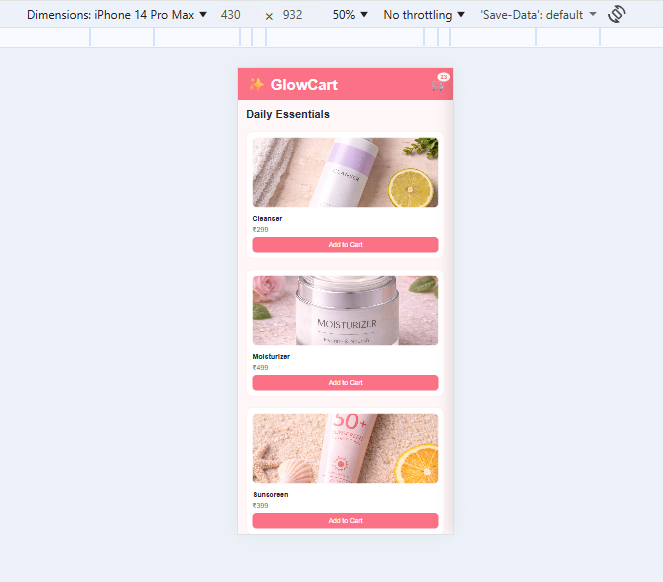
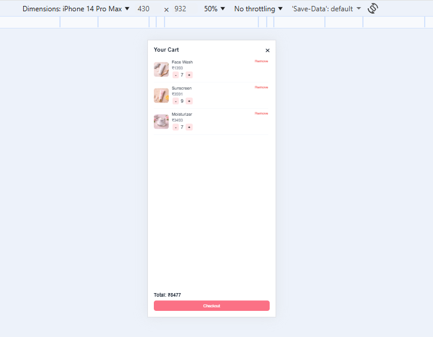

# GlowCart - Skincare E-commerce UI

GlowCart is a responsive skincare e-commerce web application built using HTML, CSS, and JavaScript. It allows users to browse products, add items to cart, manage quantities, and view real-time pricing with a clean and modern UI.

---

## Live Demo
https://glow-cart-project.vercel.app/

---

## Features

- Product listing with categories
- Add to cart functionality
- Quantity increase/decrease
- Remove items from cart
- Dynamic total price calculation
- Real-time UI updates
- Cart persistence using localStorage
- Fully responsive (Mobile, Tablet, Desktop)

---

## Tech Stack

- HTML5
- CSS3
- JavaScript

---

## Screenshots

### Desktop View


---

### Tablet / iPad View


---

### Mobile View


---

### Mobile Cart View


---

## How to Run Locally

```bash
git clone https://github.com/dhwani1006/GlowCart_Project.git
cd GlowCart_Project
open index.html
